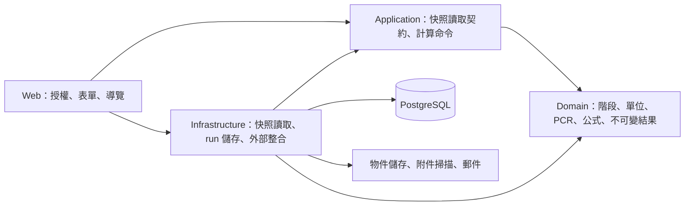

# 技術架構與資料流

更新：2026-09-07。依據[產品需求](04_PRODUCT_REQUIREMENTS.md)及 [ADR-0007](adr/0007-lifecycle-workflow-and-snapshot-boundary.md)。沿用 ADR-0002 的 C#／ASP.NET Core 10、PostgreSQL 18 與模組化單體，不重建技術棧。

## 設計主軸

以「產品版本 → 盤查專案版本 → 五階段活動 → 不可變計算 → 結果／審核」為主流程。PCR、係數、單位與證據提供共用規則及來源。組織／身分、通知、匯入及稽核支援主流程。

五階段是同一盤查內的資料分類與計算規則，並非五個獨立部署單位。用現有四個專案及 Domain 模組維持邊界，不建立 planning baseline 所示的額外 SharedKernel、AppHost 或每模組四套專案。



`Web → Infrastructure` 是現有相依，包含啟動組裝與尚未遷出的工作區資料操作。這不是所有模組都已完成隔離的宣告。Domain 不依賴 Web、Application、EF Core 或外部資源；Application 不依賴 Web 或 Infrastructure。

## 實際責任與位置

| 責任 | 現有位置 | 邊界 |
|---|---|---|
| 組織與產品 | Domain `Organizations`／`Products`，Infrastructure 同名服務與 Persistence | 穩定 ID、組織隔離、產品版本；單一 active membership 依 ADR-0006 |
| 規則與共用目錄 | Domain `Standards`／`Factors`／`Units` | PCR 適用性、係數與單位版本，不把公共係數的發布狀態等同適合所有產品 |
| 五階段盤查 | Domain `Inventories`，Web `Workspace`，Persistence records | 階段適用性、活動種類、來源與估算；目前活動為共用資料列 |
| 計算輸入 | Application 快照讀取契約，Infrastructure snapshot reader | 同一組織的專案、階段、活動、係數與單位組成 Domain 快照；讀取不寫入 |
| 計算輸出 | Application `CalculateInventoryHandler`，Domain `Calculations`，Infrastructure `CalculationRunStore` | 明確命令計算與保存，固定 manifest／雜湊及 lineage |
| 審核、報告與匯出 | Domain `InventoryWorkflow`／`Reporting`、Application `Exports`、Web `Reports`／`ArchiveReport` | 內部核准與對外查驗狀態分開；歷史結果以指定 run 為準 |
| 證據與稽核 | Domain `Evidence`／`Audit`，Infrastructure 對應實作 | 附件掃描與內容雜湊、不可變結果、append-only 稽核 |
| 來源整合 | 係數同步服務、LegacyImporter／staging | 公共資料依 ADR-0004；舊檔僅作候選資料，不自動發布 |

## 計算快照邊界

```text
計算／送審／結果有效性檢查
  → 既有頁面授權與專案狀態檢查
  → Application 快照讀取契約（專案 ID）
  → Infrastructure 依組織範圍組裝 InventoryProjectSnapshot
  → Domain 的 PCR／計算／manifest 比對

明確計算命令
  → CalculateInventoryHandler
  → CalculationEngine
  → ICalculationRunStore
  → 不可變 run、明細、階段摘要、警告及稽核
```

這次將原本 `WorkspaceModel.BuildSnapshotAsync` 的資料查詢與映射移至 reader，三個使用情境共同走此邊界；不把 EF record 暴露給 Application，也不複製單位版本選擇規則。

此調整保留現有交易與併發行為，沒有額外宣稱多次資料查詢具有新的交易快照保證。PCR 驗證、最新 run 選取與工作流編排仍有部分在 Web；後續調整需以完整用例為單位，不能只搬檔後宣稱全面完成模組隔離。

## 資料模型與待補語意

持久化實體對照見[資料模型](data-model/README.md)。目前 `ActivityDataRecord` 可保存階段、活動種類、原始／標準值、分配比例與情境文字，但以下需求不可只靠新增文字欄位宣告完成：

- BOM 的結構、相同材料彙整與供應來源關係。
- 全廠數據的期間、產量、分配分子／分母及每宣告單位正規化。
- 可重用使用模式、情境變數的時間單位與版本。
- 廢棄處理方式的占比基礎、完整性與互斥情境。

原始滑鼠表的三家焚化廠是替代估算，並非三筆實際處理流向。後續情境模型須區分這兩類，防止重複計量；分配基礎及係數代表性的公開方法依據見[官方來源核對](architecture/LEGACY_PURPOSE_ANALYSIS.md)。

這些是依原始目的確認的後續模型切片，須由案例與領域規則決定欄位及公式；本次不建立空資料表、不改 schema、不改歷史 manifest。

## 部署與驗證

沿用一個 Web 應用搭配 PostgreSQL、S3 相容物件儲存、ClamAV 與郵件服務；本機組態使用 MinIO／Mailpit，migration 為現有一次性工作。具體設定以根目錄 Compose 及 runbooks 為準。本次不啟用新的排程、地圖付費 API 或正式部署。

依專案規則執行 restore、Release build、全套 tests 及格式檢查；快照 reader 檢查組織隔離與映射一致性，Architecture tests 檢查 Domain／Application 依賴方向。沒有 schema／公式變更時不新增 migration 或重新定義 Golden 答案。測試結果見[實作狀態](IMPLEMENTATION_STATUS.md)，既有 RC 紀錄不代替本次驗證。
