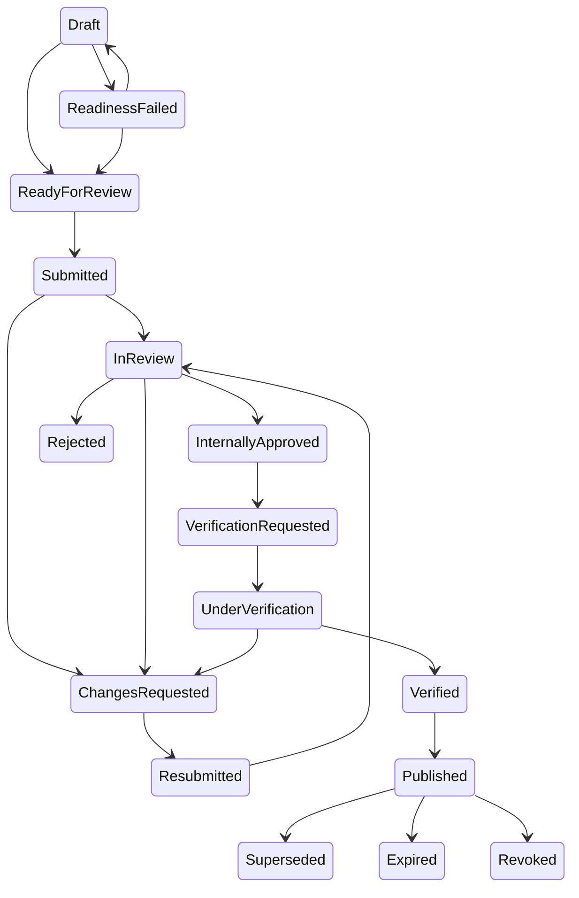

# Governance and verification operations

This document describes the executable governance controls introduced for issues #21–#30. The authoritative user interface is `/Governance`; the authenticated integration surface is `/api/governance`.

## Role and permission matrix

| Organization role | Inventory editing | Governance definitions | Internal review | External verification | High-impact transition |
| --- | --- | --- | --- | --- | --- |
| Owner | Yes | Yes | Yes | Yes | Verified MFA required |
| Administrator | Yes | Yes | Yes | Yes | Verified MFA required |
| Contributor | Yes | No | No | No | Not allowed |
| Reviewer | No | No | Yes | No | Verified MFA required for approval |
| Verifier | No | No | No | Yes | Verified MFA required |
| Viewer | No | No | No | No | Not allowed |

A verifier is intentionally separate from a contributor and reviewer. The workflow also rejects approval or verification when the same actor created or materially edited the governed project version.

## Workflow



The server is the source of truth for allowed transitions. Client-side controls never bypass readiness, blocking findings, signed verification records, separation of duties, immutable-input checks, or MFA.

## Governance definition lifecycle

1. Create a new draft version with a stable key and canonical JSON payload.
2. Validate its type-specific schema.
3. Publish only after required source metadata and clean source evidence are available.
4. Activate or prohibit a published version for an organization.
5. Create a new version instead of modifying published content.
6. Withdraw or supersede old versions while retaining historical references.

Supported definition types are:

- `DataQualityRuleSet`
- `ActivityFormula`
- `GlobalEmissionFactor`
- `TransportRouteTemplate`
- `EvidenceRetentionPolicy`

Every version stores a canonical SHA-256 digest, source metadata, validity period, supersession link, actor and timestamps.

## Activity governance

The governance console accepts the versioned domain JSON objects defined by the Domain assembly. Submitted payloads are validated and canonicalized by the server.

- Data quality: `DataQualityAssessmentVersion` and optional `UncertaintyInput[]`.
- Allocation: `AllocationPoolVersion`; the server recalculates shares and validates the denominator and 100-percent balance.
- Formula: a published `ActivityFormula` definition and normalized input values.
- Transport: `TransportChainVersion`; the server calculates ordered legs and TTW/WTT/WTW traces.
- Global factor: a published global factor definition with organization activation controls.

Saving governed inputs invalidates stale calculations and appends governance events. Calculation line items preserve formula and governance traces.

## Evidence chain

Evidence is uploaded through the server and is not accepted from a client-provided hash.

1. Enforce the configured maximum file size.
2. Compute SHA-256 server-side.
3. Run the configured malware scanner.
4. Store the object under the organization namespace.
5. Deduplicate identical physical content while preserving logical documents and immutable versions.
6. Link a version to activities, factors, PCR versions, allocation pools, calculation runs, findings or verification records.
7. Audit every authorized download using a hashed requester address.
8. Apply retention locks when a project is submitted, approved or verified.

Retention-locked evidence cannot be replaced or deleted.

## Readiness gate

`GET /api/governance/projects/{projectVersionId}/readiness` returns deterministic rule codes, severity, owner, lifecycle stage, message and remediation. Required-explanation items need a persisted acknowledgement before submission. The same validator is reused by the console and workflow transition service.

## API and CSRF

The API uses the existing authenticated application cookie and organization scope. Obtain an antiforgery token first:

```text
GET /api/governance/antiforgery
```

Send the returned request token in the returned header for every state-changing API request.

Available routes:

```text
GET  /api/governance/projects/{projectVersionId}/overview
GET  /api/governance/projects/{projectVersionId}/readiness
POST /api/governance/projects/{projectVersionId}/acknowledgements
POST /api/governance/projects/{projectVersionId}/transitions
POST /api/governance/projects/{projectVersionId}/archives/{calculationRunId}
GET  /api/governance/archives/{archiveId}
GET  /api/governance/evidence/{documentVersionId}
```

Organization permission checks and EF Core tenant filters apply to every route.

## Verification archive

The archive is generated only from a selected immutable calculation run. It includes:

- HTML inventory report
- XLSX workbook
- canonical manifest
- calculation line and stage CSV files
- factor register
- unit-conversion, allocation and governance traces
- evidence index
- readiness results
- review findings
- verification records
- audit and workflow events
- per-file SHA-256 index and archive digest

ZIP timestamps and ordering are deterministic. The builder verifies the archive before persistence. Stored archives are append-only and tenant-scoped.

## Migration and rollback

Apply migrations with the supported deployment entry point:

```text
dotnet run --project src/CarbonFootprint.Web --configuration Release -- --migrate
```

Before deployment, back up PostgreSQL and object storage. The governance migration is additive. Rollback means deploying the previous application version and restoring the matching database backup; do not manually delete immutable governance, evidence, audit or archive rows.

## Remaining operational work

The application has an in-app notification outbox represented by immutable `notification.created` governance events. Production deployments may add an email or webhook dispatcher without changing workflow semantics. External source adapters beyond the configured MOENV synchronization and formal third-party UAT remain deployment-specific activities.
